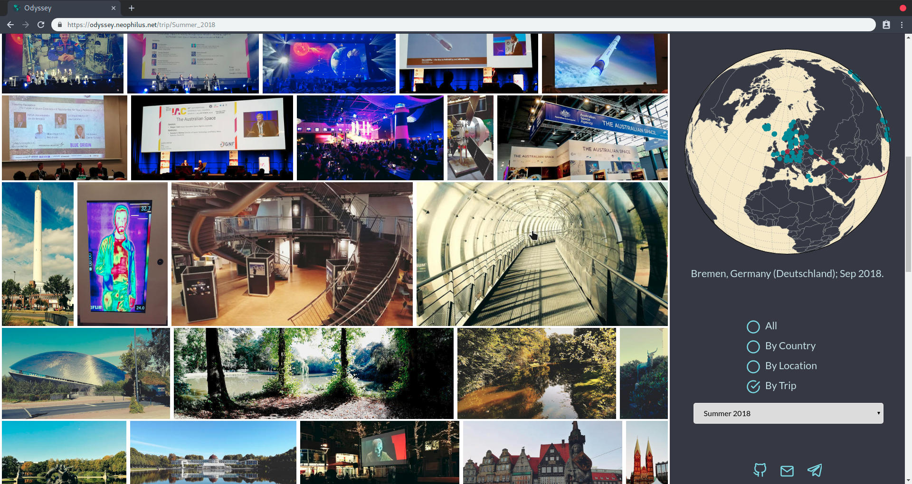

# Odyssey

A photoblog of my adventures. [https://odyssey.neophilus.net](https://odyssey.neophilus.net)

<center></center>

## Usage

If you wish to use something similar, there are a few conventions you need to abide by.

### Directory structure

Odyssey assumes all images reside in `dist/gallery` under a directory structure that follows `<year>/<month>/<country>/<location>`, for example `2015/04/Norway/Oslo`.
Places and countries with spaces in their names should be rendered as `Ho_Chi_Minh_City`.
Image files can be named however you wish.

### odyssey.yaml

Once your files are stored correctly in the gallery structure there is one important file to maintain.
`manifester/odyssey.yaml` takes care of two lists: `places` and `trips`.

---

Places requires a list of all countries in the gallery with sub-lists of locations in the gallery.
As Odyssey is targeting English, local names can be stored here and will be incorporated into the gallery.
The local name for a country should be a sub-list element:

```yaml
Norway:
  Local: Norge
```

Locations can be the value corresponding to the sub-list's key: `Gothenburg: Göteborg`.
So a complete example could be:

```yaml
places:
  Sweden:
    Local: Sverige
    Are: Åre
    Gothenburg: Göteborg
    Stockholm:
```

---

The Trips list is a little more involved, but needs to be so that the paths that are traced on the globe look like you'd anticipate.

Here's an example from my trip list to study:

```yaml
trips:
  - name: S16
    description: Summer 2016
    cities:
      - Gothenburg
      - Frankfurt
      - Vienna
      - Yerevan
      - Vienna
      - Frankfurt
      - Gothenburg
      - Tallinn
      - Helsinki
      - Gothenburg
      - Stockholm
      - Gothenburg
      - Copenhagen
      - Crete
      - Athens
      - Frankfurt
      - Freiburg
      - Frankfurt
      - Gothenburg
    dates:
      - 2016/05
      - 2016/06
      - 2016/07
      - 2016/09
```

- `name` is an identifier that is used internally to identify each trip. Choose a short but unique ID.
- `description` is the one that shows up in the filter list in the menu, as well as the URL.
- `cities` is a list of locations visited, in order on your trip. You can easily see that I was living in Gothenburg in 2016, since I start and end there, as well as stopped by multiple times during `Summer 2016`. The world map traces this list and puts a line between each pair in the list. It makes sense that my day trip to `Stockholm` is sandwiched between two `Gothenburg`s&mdash;otherwise the world map would show me jumping from `Stockholm` to `Copenhagen`, which didn't happen.
- `dates` is a crude but effective method of filtering trips. Simply list the months your trip was on here, and the gallery will grab all images from the list of cities within the time-frame of the months listed here.

### .desc files

The manifester generates empty `.desc` files for each image if one doesn't exist.
If you wish to add a short description to a photo, write it in this file and the manifester will add it next pass.
This file is not escaped, so please use `\"` if you need quotations in your description.

### Updating a gallery

Once your files are organised, you can build your manifest by calling `make manifest`. This will  generate all needed code for the updated `world.json` and `Manifest.elm` files.
`make build` will generate all the javascript for the app, so you can preview the gallery before deployment: `make serve` will do this for you.
`deploy` is a one-command update and upload trigger, so if you've just added images and nothing else, this is the only tool you want.

## Development

Assumes you're using a modern linux distro with [Elm 0.19](https://elm-lang.org/) and [Rust](https://www.rust-lang.org/) installed. As well as the inclusion of [elm-live](https://github.com/wking-io/elm-live), [uglifyjs](http://lisperator.net/uglifyjs/) and [crass](https://github.com/mattbasta/crass) in your toolchain.

`make debug` gives you the Elm time-travelling debugger when live-previewing your changes.

## License

Released under the BSD 3-Clause "New" or "Revised" License, in line with most Elm libraries used within.

[](https://app.fossa.io/projects/git%2Bgithub.com%2FLibbum%2FOdyssey?ref=badge_large)
